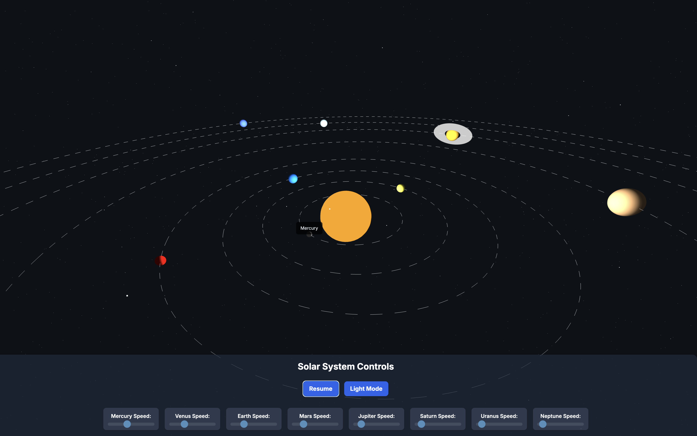
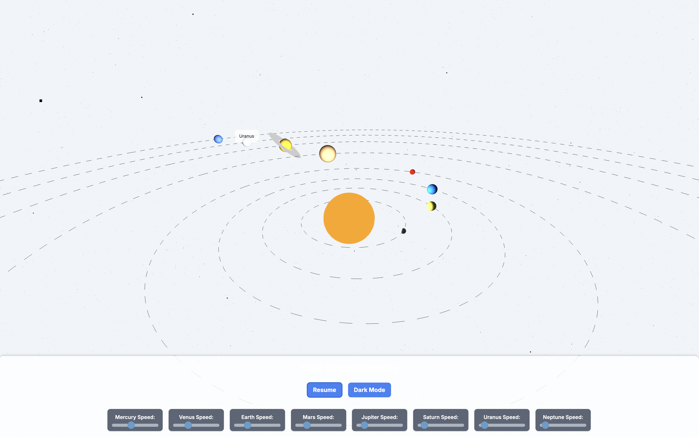

# 🌍 3D Solar System Simulation
A JavaScript (ThreeJS) Project

This project creates an interactive 3D simulation of our solar system using [Three.js](https://threejs.org/), a powerful JavaScript 3D library. It features the Sun at the center with all eight planets orbiting and rotating. Users can control the orbital speed of individual planets, pause/resume the animation, and toggle between dark and light themes.

---

## ✨ Features

- **Realistic 3D Scene**: The Sun and all eight planets (Mercury to Neptune) rendered as 3D spheres.
- **Orbital and Rotational Animation**: Planets orbit the Sun along elliptical paths and rotate on their own axes.
- **Axial Tilts**: Planets are rendered with realistic axial tilts for a more accurate visual representation.
- **Saturn's Ring**: Saturn is depicted with a prominent ring system.
- **Speed Control**: Individual sliders allow real-time adjustment of each planet's orbital speed.
- **Pause/Resume Functionality**: A button to pause and resume the entire simulation.
- **Camera Controls**: Drag your mouse or touch to rotate the camera around the solar system.
- **Planet Tooltips**: Hovering over a planet (or touching on mobile) displays its name.
- **Starfield Background**: A dynamic background of stars that changes color with the theme.
- **Dark/Light Mode Toggle**: Switch between dark and light themes for the UI, stars, and orbit lines.

---

## 🛠️ Technologies Used

- **HTML**
- **JavaScript** (Pure JavaScript for Three.js logic)
- **[Three.js](https://threejs.org/)** 
- **Tailwind CSS** (for responsive UI and control styling)

---

## 🚀 How to Run

1. **Save the Code**  
   Save the provided HTML code into a file named `index.html`.

2. **Open in Browser**  
   Open `index.html` with any modern web browser (Chrome, Firefox, Edge, etc).

---

## 🧭 Usage Instructions

- **Camera Movement**  
  Click and drag (or touch and drag on mobile) to rotate your view around the solar system.

- **Planet Speed Control**  
  Use the sliders in the **Solar System Controls** panel to adjust the orbital speed of each planet.

- **Pause/Resume**  
  Use the **Pause** / **Resume** button to stop or restart planetary motion.

- **Planet Information**  
  Hover or tap on any planet to display its name as a tooltip.

- **Theme Toggle**  
  Click the **Light Mode / Dark Mode** toggle to change the visual theme. Starfield and orbit lines will adjust accordingly.

---

## 📸 Preview

<table>
  <tr>
    <td align="center"><strong>Dark Mode</strong></td>
    <td align="center"><strong>Light Mode</strong></td>
  </tr>
  <tr>
    <td></td>
    <td></td>
  </tr>
</table>

---

## 🧑‍💻 Author

**Aaditya Sattawan**  
```
https://github.com/Tiku57/3D-Solar-System-Model
```
---
